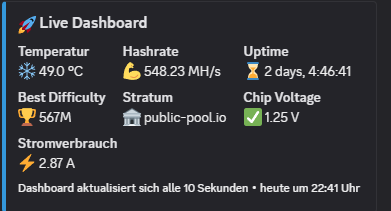

# 🤖 BitAxe Discord Bot

Ein leistungsstarker Discord-Bot zur Überwachung deines **Bitaxe Miners** in Echtzeit.  
Perfekt für dein Mining-Homelab oder NerdAxe-Setup!

---

## 🚀 Features

- 🟢 **Live-Dashboard** mit kontinuierlicher Aktualisierung (Embed)
- 🔄 **Automatische Benachrichtigungen**:
  - Neue Best Difficulty erreicht
  - Wechsel auf Fallback-Stratum
  - API nicht erreichbar
  - Hashrate unter kritischen Schwellen
- 🖥 **Farbliche Konsolenausgabe** mit Echtzeitdaten
- 📈 **Historie der Best Difficulties** (inkl. JSON-Logging)
- 📋 **Kommandos für alle Systemdaten** – direkt in Discord

---

## 🛠 Setup

### 1. Voraussetzungen

- Python 3.10 oder neuer empfohlen
- `pip install -r requirements.txt`

### 2. Konfiguration

Passe die Datei `config.ini` an:

```ini
[discord]
token = DEIN_DISCORD_BOT_TOKEN
channel_id = DEIN_DISCORD_CHANNEL_ID

[bitaxe]
api_url = http://dein.bitaxe.ip/api/system/info

[settings]
console_interval_sec = 10
dashboard_interval = 30
timezone = Europe/Berlin
```

### 3. Starten

```bash
python bitaxediscordbot.py
```

---

## 💬 Verfügbare Befehle (alle per `!`-Prefix)

| Befehl       | Beschreibung |
|--------------|-------------|
| `!dashboard` | Live-Embed mit aktuellen Werten |
| `!status`    | Zusammenfassung aller Hauptwerte |
| `!hashrate`  | Aktuelle Hashrate |
| `!temp`      | Temperatur und VRM-Temp |
| `!uptime`    | Uptime des Miners |
| `!chip`      | Chip-Modell, Frequenz & Spannung |
| `!power`     | Leistung, Spannung & Strom |
| `!fans`      | Lüftergeschwindigkeit & RPM |
| `!wifi`      | WLAN-Status, SSID & IP |
| `!version`   | Firmware & Reset-Infos |
| `!stratum`   | Primärer & Fallback-Stratum |
| `!best`      | Aktueller & historischer Best-Difficulty |
| `!info`      | Kompakter Systemüberblick |
| `!help`      | Hilfe zu allen Befehlen |

---

## 📊 Beispiel: Live Dashboard



---

## 🧠 Infos

- Entwickelt für NerdAxe/Bitaxe Miner
- Open Source – feel free to contribute!

---

## 🛡 Sicherheitshinweis

⚠️ **Lege `config.ini` niemals öffentlich ins GitHub-Repo!**  
Der Bot-Token gibt vollständigen Zugriff auf deinen Bot!

---

Viel Spaß mit deinem BitAxeBot! 🥳
